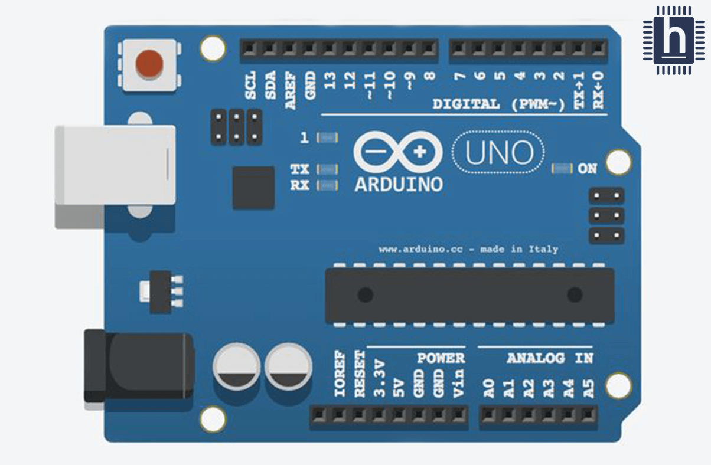

# Wiring Your Wind Turbine for Testing
The first thing you do is make sure you have all the parts needed to start wiring.
## Things you will need:
- Wires 

- Breadboard

- Your Wind Turbine

- Battery

- Arduino

### Steps

1.  plug the battery's into the arduino via the GND and 3.5V.

2. plug your arduino up with your wind turbine via the GND and 13 port.

3. Enjoy!
