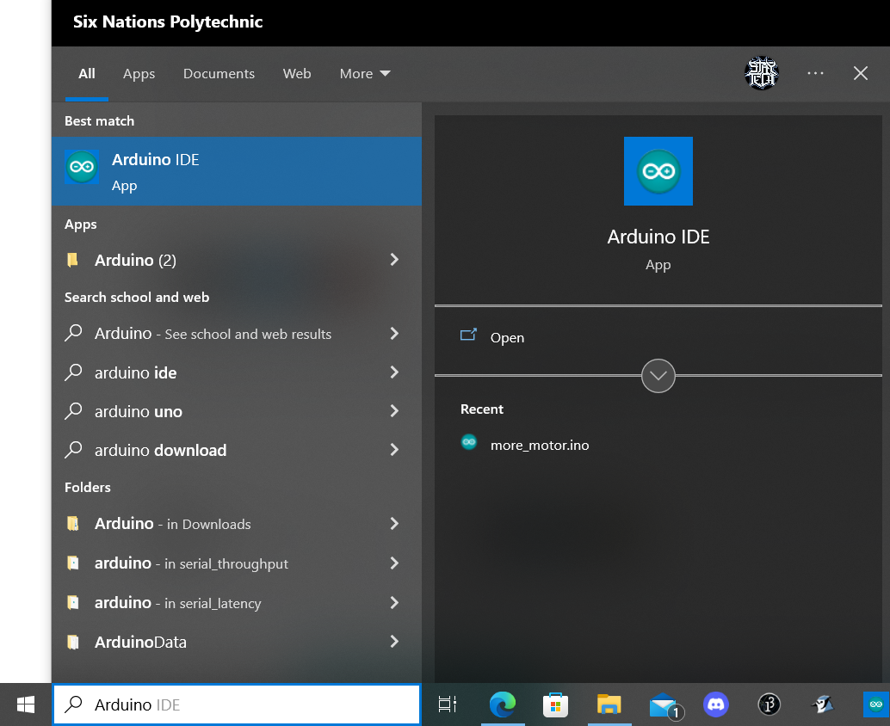
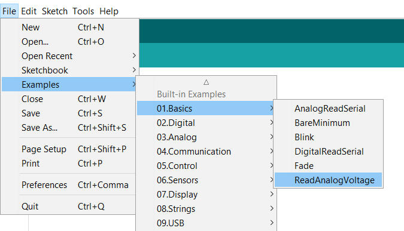
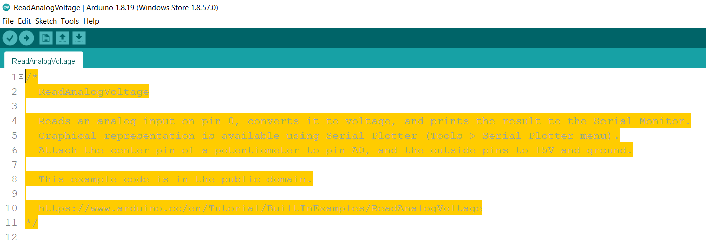
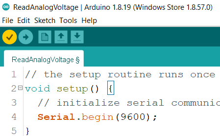
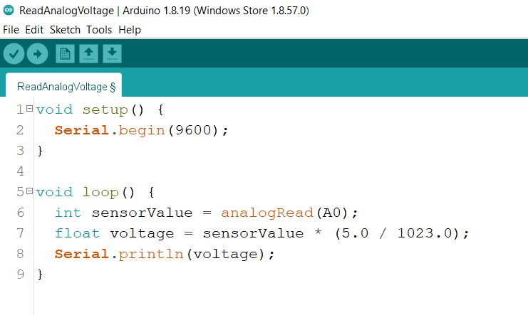
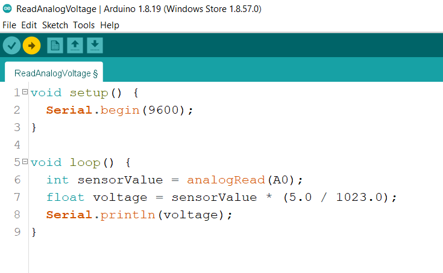

# How to get and use Arduino's sample code

## To open Arduino, search Arduino in the lower left search bar and click Arduino icon

---
## In the top left corner, click on file - examples - basics - ReadAnalogVoltage

---

## The code shown below can be deleted

--- 

## In the top left corner, click the check mark to verify the code

---

## What does the code do?

Void setup is what makes sure everything works and what starts the code.
T
Void loop is what will show us the voltage, it will keep on running until we turn it off. Line 6 takes in our numbers in what we call sensorValue. Line 7 converts the sensorValue numbers into voltage numbers. Line 8 shows us the numbers in voltage and graphs it.

---

## Sample code will be ready for use

Once you have everything setup to your computer, your ready to run the code!

