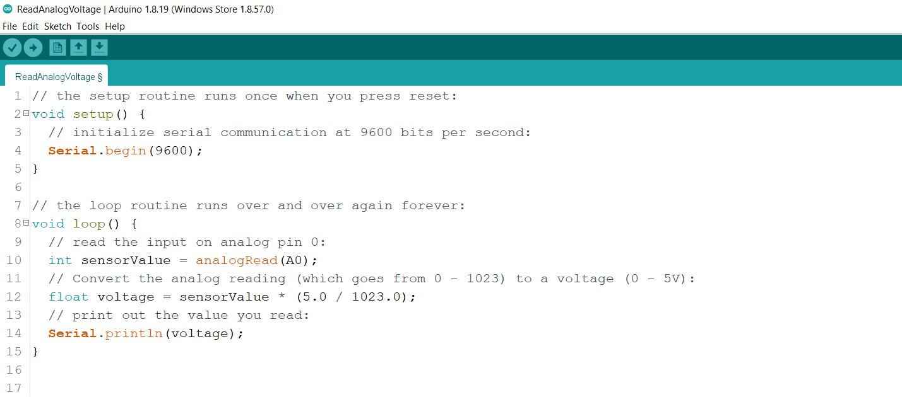

# How to get and use Arduino's sample code

## To open Arduino, search Arduino in the lower left search bar and click Arduino icon

---
## In the top left corner, click on file - examples - basics - ReadAnalogVoltage

## Sample code will be ready to run

