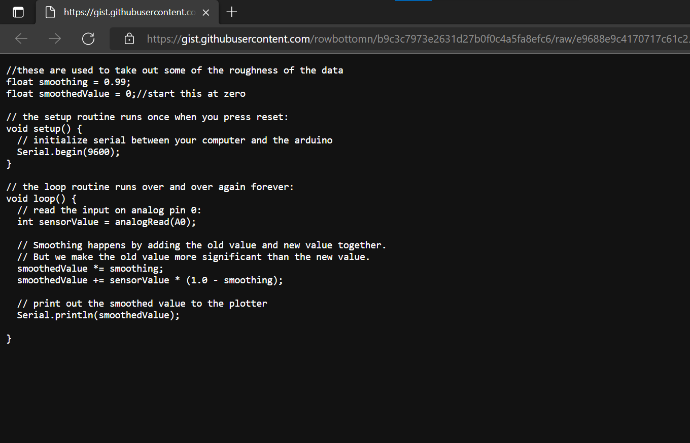
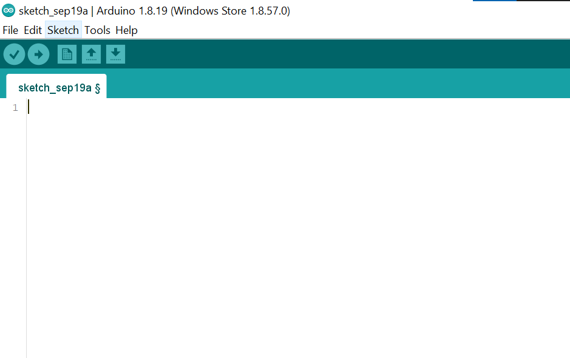
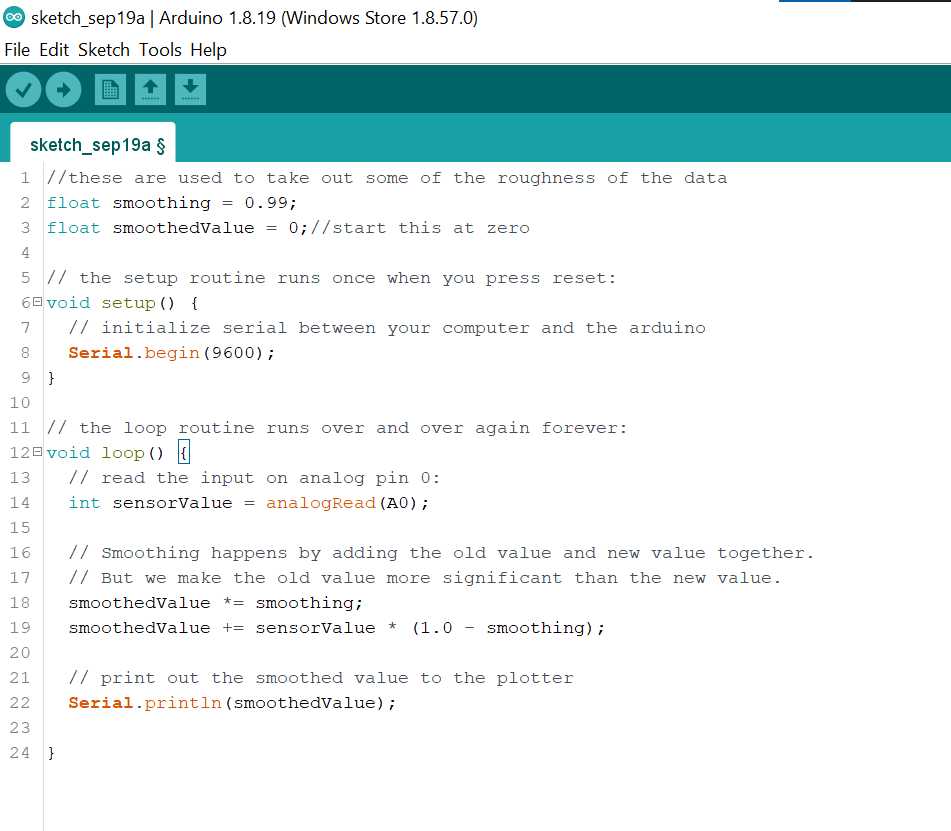
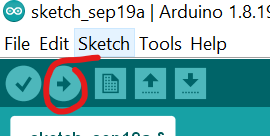

# How to get the code for your Arduinos turbines into your Arduino IDE

### Use this link to copy the code you will be using for this project.
### [link to the smoothed code](https://gist.githubusercontent.com/rowbottomn/b9c3c7973e2631d27b0f0c4a5fa8efc6/raw/e9688e9c4170717c61c25ba721878b02d8e2753e/smoothed.ino)

when opened the page should open like this

Copy all of the text on the page by using 
Ctrl + A and then Ctrl + C. after that open up **Arduino IDE**

## **Auduino**
### once in Arduino delete all code until your canvas looks like this

### click on the page and use the shortcut Ctrl + V to paste the code into Arduino and it should look like this 

## Code explanation

The code itself uses the Loop function to continuously run code without stoping. and the code inside the loop is reading the voltage the turbine is outputing. It also uses the smoothing function that gathers values and avarages them out to make them easier to read. This is very useful for Sensors that are very jumpy or erratic.

### How to send the code to the Arduino

After your done coding and want to test it out you need to send that code to your Arduino

Make sure your Arduino is plugged into your computers USB port and Press this button in Arduino IDE.

The nice part about this is that even if the Arduino doesn't have power it still stores the code for future use!
