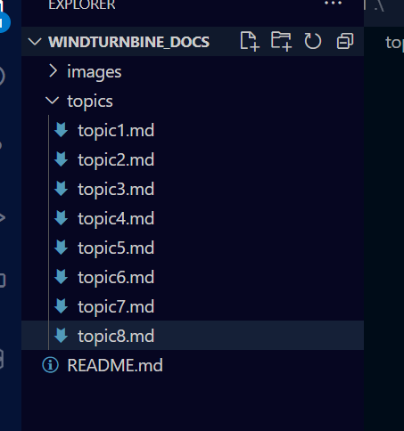

# Follow up

## So What Did We Learn?

## What were some variables?

## Which were controlled indepenedent, depenedent?

## In Which ways were our wind turbines a good model of a real world one?  In which ways was it a bad model?

## What was the most difficult aspects of the day and why?

## Career Connection : Wind Turbine Technician
